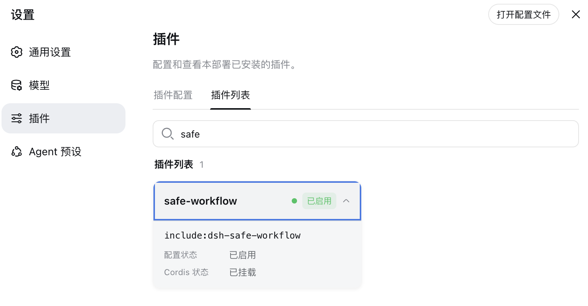
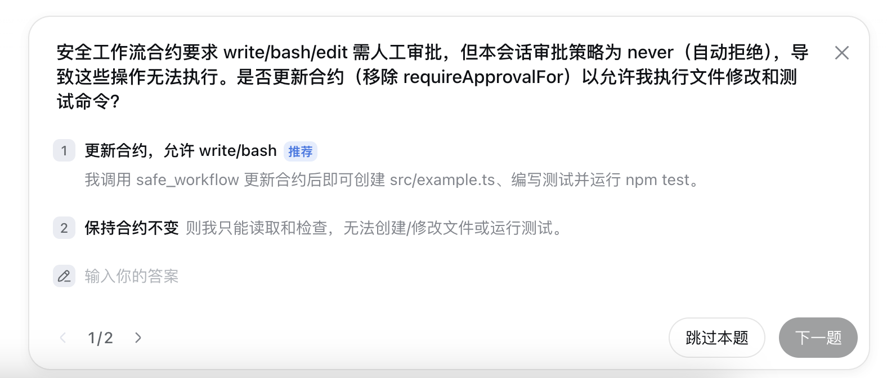

# dsh-safe-workflow

[English](README.md) | 简体中文

一个独立的 DeepSeek Harness 插件，用于构建更安全、可验证、可恢复的 Agent 编码工作流。

它提供一个面向模型的工具 `safe_workflow`，支持以下操作：

- `start`：创建任务契约；
- `status`：查看当前任务契约；
- `checkpoint`：保存当前工作区快照；
- `restore`：恢复指定快照；
- `verify`：执行验证命令并记录输出；
- `close`：关闭任务契约。

同时，它注册两个原生策略监听器：

- `tools/pre-execute`：检查路径规则，并在执行可变更工作区的工具前请求审批；
- `tools/execute`：在副作用工具真正执行前创建最佳努力 checkpoint。

## 安装到 DSH 源码工程

先构建本插件：

```bash
npm install
npm run check
```

然后从 DSH 工程中，把这个独立目录安装到 Web profile：

```bash
DSH_DIR=/path/to/deepseek-harness
PLUGIN_DIR=/path/to/dsh-safe-workflow

cd "$DSH_DIR"
pnpm dsh plugin --profile web add "$PLUGIN_DIR"

pnpm dsh --profile web --dump-config | grep dsh-safe-workflow
pnpm dsh web
```

安装完成后，可以在 DSH 的插件列表中看到并启用本插件：



本插件不会修改 DSH 主工程源码，只会作为 profile dependency 安装到 DSH 的 profile 目录中。

## 一个基本工作流

启动 DSH 后，可以让 Agent 先创建任务契约：

```text
请启动一个安全工作流，标题是“修复解析器回归问题”。

目标：修复解析器回归问题，但不要修改公共 API。

验收标准：
1. npm test 通过；
2. npm run typecheck 通过。

只允许修改 src/ 和 test/ 目录。
修改前需要对 bash、write、edit 和 str_replace_editor 请求人工审批。
```

之后要求 Agent 在完成修改后执行：

```text
使用 safe_workflow verify 执行 npm test 和 npm run typecheck。
只有验收标准全部通过后，才能关闭安全工作流。
```

当 Agent 即将执行文件修改等可变更操作时，审批门禁会展示操作内容，并允许批准或保持当前契约不变：



也可以直接要求 Agent 手动创建 checkpoint：

```text
请先使用 safe_workflow checkpoint 创建一个名为“修复前”的检查点。
```

## 工作区状态文件

插件会在当前 session workspace 下创建 `.dsh-safe-workflow/`：

```text
contract.json       当前任务契约和验证记录
audit.jsonl         session、工具、checkpoint 和验证证据
checkpoints/        checkpoint 清单与复制的文件快照
```

如果不希望这些文件进入 Git，可以将 `.dsh-safe-workflow/` 加入项目的 `.gitignore`。

## 配置

默认的 `cordis.patch.yml` 配置如下：

```yaml
- id: dsh-safe-workflow
  name: dsh-safe-workflow
  config:
    stateDirName: .dsh-safe-workflow
    approvalMode: ask
    autoCheckpoint: true
```

配置项说明：

- `stateDirName`：工作流状态目录名称，默认是 `.dsh-safe-workflow`；
- `approvalMode`：审批模式，可选 `ask`、`allow`、`deny`；
- `autoCheckpoint`：是否在可变更工具执行前自动创建 checkpoint；
- `mutatingTools`：额外声明为可变更工具的工具名列表。

通常建议保留 `approvalMode: ask` 和 `autoCheckpoint: true`。如果设置为 `allow`，插件不会主动请求审批，但 DSH 其他安全策略仍可能继续生效。

## 默认路径策略

默认禁止访问或修改：

```text
.env
.env.*
.git/**
node_modules/**
```

任务契约还可以通过 `allowedPaths` 设置允许修改的目录。例如：

```text
只允许修改 src/**、test/** 和 package.json。
```

路径规则只约束插件能够识别到的文件参数。对于任意 shell 命令，插件无法完美推断命令内部会修改哪些文件，因此 shell 工具默认需要审批。

## Checkpoint 与恢复

自动 checkpoint 会在识别到以下类型的工具执行前触发：

```text
bash、pwsh、shell、write、edit、delete、move、copy、rename、mkdir、
fs_write、fs_edit、str_replace_editor
```

对于 `write`、`edit` 等带明确文件路径的工具，插件会保存对应文件的快照。对于 shell 工具或手动对整个工作区创建 checkpoint，插件会递归保存工作区文件，同时跳过：

- `.git/`；
- `node_modules/`；
- `.dsh-safe-workflow/`。

恢复时，插件会把快照中的文件复制回原位置，并删除快照中记录为“不存在”的文件。

## 重要限制

这是一个工作流门禁插件，不是进程级沙箱。

插件代码运行在 DSH 宿主进程中，并继承宿主进程的权限。第一版提供的是：

- 任务策略；
- 工具审批；
- 文件路径限制；
- 操作证据；
- 最佳努力文件快照和恢复。

它不能保证原子回滚以下副作用：

- 任意 shell 命令；
- 网络请求；
- 数据库写入；
- 外部服务调用；
- 未被 checkpoint 包含的文件；
- 工具内部产生的进程状态。

因此，生产环境使用时仍然应该：

1. 阅读并审查插件源码；
2. 锁定插件版本或 Git commit；
3. 同时启用 DSH 自带的 sandbox 和 approval 层；
4. 在不包含生产凭据的测试 workspace 中验证；
5. 对重要项目使用 Git 分支或 worktree。

## 开发与测试

```bash
npm install
npm run build
npm test
npm run check
```

当前测试覆盖了：

- 默认 `.env`、`.git` 路径拦截；
- `allowedPaths` 和工作区外路径拦截；
- 可变更工具识别与文件路径提取。

## 设计目标

`dsh-safe-workflow` 不修改 DSH Agent loop，而是使用 DSH 官方扩展点实现安全工作流：

```text
任务契约
  ↓
工具审批
  ↓
副作用前 checkpoint
  ↓
执行与验证
  ↓
证据记录
  ↓
关闭、恢复或继续任务
```

后续可以继续扩展：

- Git worktree 级 checkpoint；
- 多 Agent 共享任务契约；
- 验收标准自动判定；
- Web UI 任务状态卡片；
- diff review 和人工批准；
- 更严格的插件权限审计。
